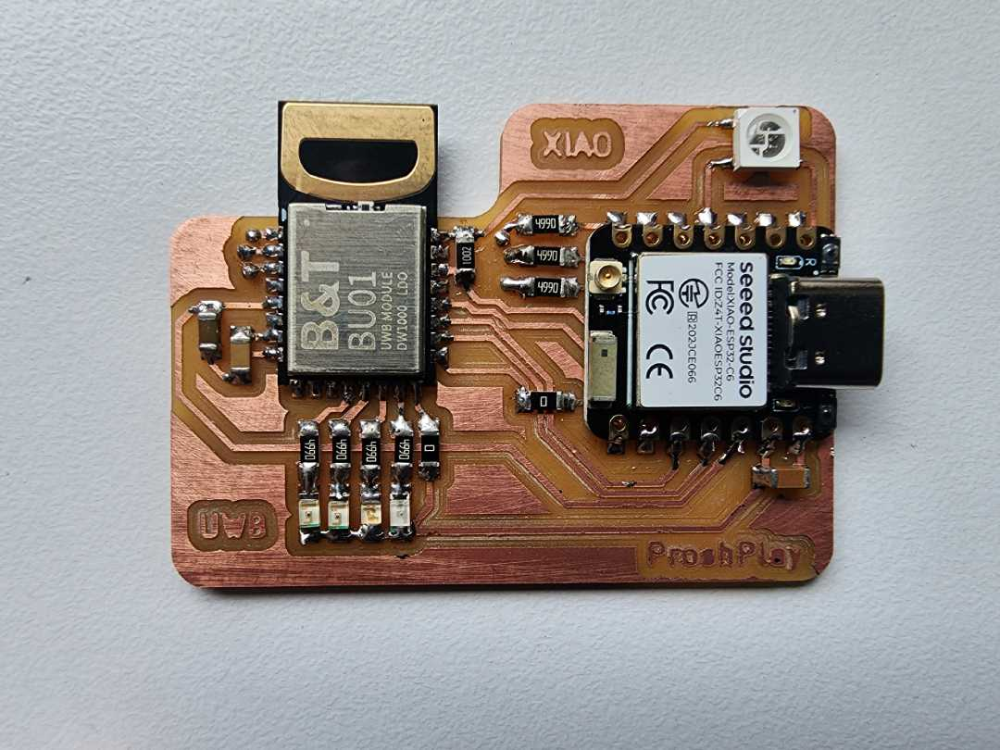
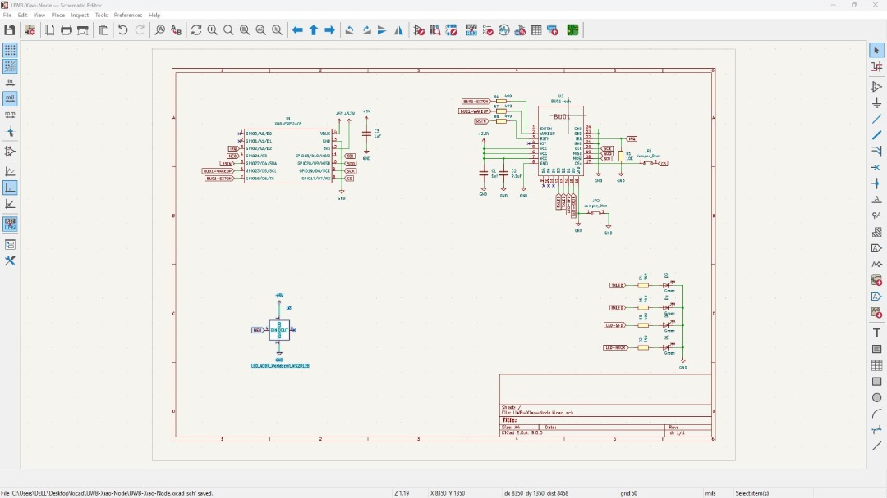
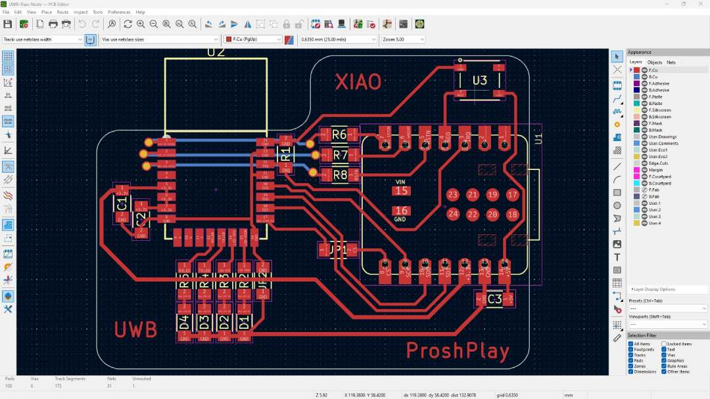
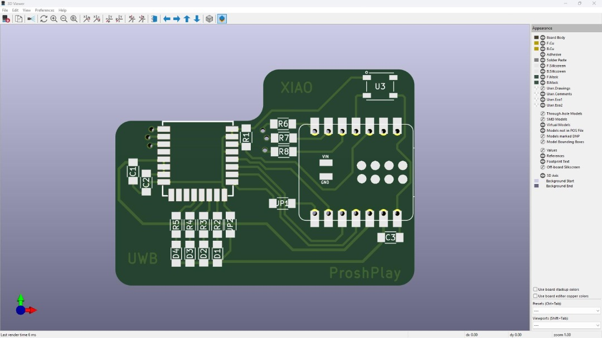

# Xiao_RP2040_UWB-BU01_Anchor-Node!

 The UWB (Ultra wide band ) is a cool thing to have in projects involve indoor location tracking and robotics, tracking devices, Then there is a Module called BU01 DW1000 available for the maker's to explore and add this amazing pice of technology to their project, This documentation of mine is a step to the UWB and the Xiao that I did in Super Fablab Kerala - Kochi  

Here is the cool board I made with the Module and Xiao ESP32 C6

## Schematic

## PCB Layout

## PCB 3D view

## Issues 
 I've faced several issues with the experiment with the new Xiao ESP32 C6 and the module probably the library support I assume

 - The libraries not compiling initially coz its made for older version of Espressif Board
 - the BU01's IRQ pin connected to the Xiao Esp32 C6 is giving an exceptional error on the serial monitor 

 ## Fixes

- Replaced the Xiao ESP32 C6 with the Xiao RP2040 (it was easy since both share same pin footprints)

## References

- [Makerfabs Wiki](https://wiki.makerfabs.com/ESP32_UWB.html) 
- [BU01 Datasheet](https://docs.ai-thinker.com/_media/uwb/docs/bu01_product_specification_en_v1.0.pdf)
- [Getting Started with ESP32 DW1000 UWB (Ultra Wideband) Module](https://how2electronics.com/getting-started-with-esp32-dw1000-uwb-ultra-wideband-module/)
- [Arduino DW1000 Library](https://github.com/thotro/arduino-dw1000/tree/master)

